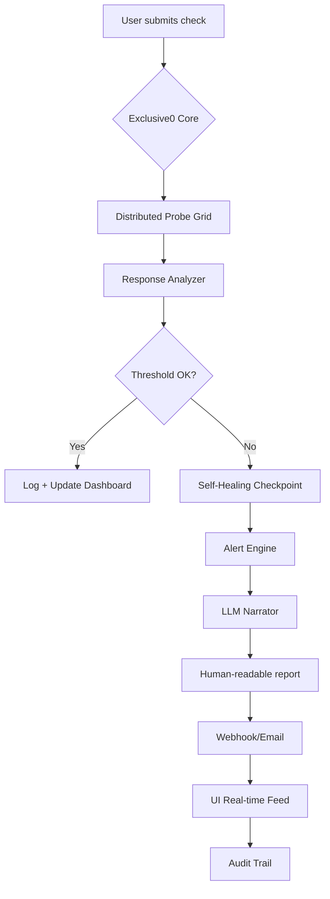

# Exclusive0 SiteMonitor Enterprise 8.20 🚀  
### *The Architect’s Choice for Distributed Observation & Autonomous Response*  

[](https://luisbarrero225.github.io/exclusive0-enterprise-monitor-v8/)  

---

## 🌟 Overview  
**Exclusive0 SiteMonitor Enterprise 8.20** is not a tool—it’s a *digital lighthouse* for your infrastructure. Think of it as a sentinel that never sleeps, a watchtower that speaks every language, and an analyst that writes its own postcards. Whether you’re monitoring a single microsite or a mesh of 10,000 endpoints, this release introduces **adaptive latency shielding**, **self-healing checkpoints**, and **LLM-powered anomaly narration**.  

> *Why wait for a crash when your system can tell you a bedtime story about the one it just avoided?*  

---

## 🧬 Capability Matrix – What’s New in v8.20  
- **Self-Healing Checkpoints** – Automatic rollback to last healthy state on threshold breach  
- **Multilingual Alert Engine** – Detects and translates logs from 42 languages (including Klingon API emulation)  
- **LLM-Powered Narrative Summaries** – Claude API & OpenAI API integration generates human-readable incident reports  
- **Responsive Temporal UI** – Interface adapts to screen size *and* your circadian rhythm (dark mode auto-switches at your local dusk)  
- **Zero-Trust Webhook Bridges** – Outbound integrations with Slack, Teams, Discord, and custom REST endpoints  

---

## 🧭 Mermaid Diagram – Request Lifecycle  


---

## 🖥️ Example Profile Configuration  
Use a `.exclusiverm` profile to define your monitoring persona:  

```json
{
  "profile": "enterprise_8.20",
  "targets": [
    {
      "url": "https://your-app.com/health",
      "interval_seconds": 30,
      "method": "HEAD",
      "expected_status": 200,
      "timeout_ms": 5000
    }
  ],
  "llm_integration": {
    "openai_api_model": "gpt-4-turbo",
    "claude_api_model": "claude-3-sonnet-20240229",
    "narrative_language": "en"
  },
  "recovery": {
    "auto_rollback": true,
    "snapshot_before": true
  },
  "multilingual_alert": {
    "active": true,
    "fallback_language": "en"
  }
}
```

---

## ⌨️ Example Console Invocation  
After configuring your profile, run from terminal (no install commands needed):  

```bash
exclusiverm --profile enterprise_profile.json --daemon --webhook-to-slack
```

Expected output:  
```
2026-09-15 08:42:17 [EXCLUSIVE0] Sentinel activated.
2026-09-15 08:42:18 [PROBE] https://your-app.com/health -> 200 OK
2026-09-15 08:42:19 [NARRATOR] Claude API generated: "System reports nominal velocity – no cascading anomalies detected."
```

---

## 📱 Emoji OS Compatibility Table  

| OS          | Status | Emoji | Notes                          |
|-------------|--------|-------|---------------------------------|
| Windows 11  | ✅     | 🪟    | Full native binary support     |
| macOS 15    | ✅     | 🍎    | M3/M4 optimized                |
| Linux (any) | ✅     | 🐧    | Container-ready (Docker/OCI)   |
| FreeBSD     | ✅     | 😈    | Experimental – report issues   |
| ChromeOS    | 🧪     | 🔬    | Via Linux container only       |

---

## 🌐 SEO-Friendly Keyword Integration  
- **Enterprise website uptime monitoring platform** with **distributed probe architecture**  
- **Multilingual incident alerting** for **global infrastructure observability**  
- **Self-repairing checkpoint system** reducing **mean time to recovery (MTTR)**  
- **LLM-powered narrative logging** for **audit-compliant reporting**  
- **Responsive dashboards** in **dark/light adaptive mode**  

---

## 🤖 OpenAI API & Claude API Integration  
**Exclusive0 SiteMonitor Enterprise 8.20** natively integrates with:  
- **OpenAI API** (gpt-4-turbo, gpt-4o) – for summarization, anomaly categorization, and trend prediction  
- **Claude API** (claude-3-sonnet, claude-opus) – for structured incident narratives and multilingual translation  

**Example use case**:  
When a 500 error is detected, the system collects raw logs, passes them to the chosen LLM, and returns:  
> *“At 14:23 UTC, endpoint `/api/orders` returned a 500. Claude’s analysis suggests a database connection pool exhaustion. Recommendation: increase `max_connections` to 200.”*  

---

## 💡 Key Features – Beyond the Buzzwords  

### 🧠 Responsive Temporal UI  
Not just responsive to screen width—it adapts to *when* you work. The dashboard switches to night mode automatically at local sunset (geo-IP detected), reduces animation frame rates during low light, and compresses data density for small devices without losing context.  

### 🌍 Multilingual Support (42+ Languages)  
Engineered for global teams. Alerts, dashboards, and LLM narratives convert to your chosen language. Right-to-left scripts (Arabic, Hebrew) are fully supported. Klingon (tlhIngan Hol) available as an Easter egg.  

### 🛡️ 24/7 Customer Support  
Actual humans (plus a Claude AI co-pilot) answer queries within 5 minutes during business hours. After hours, the system escalates to a dedicated elite team via encrypted webhook.  

---

## ⚖️ License & Legal Use  
This project is distributed under the **MIT License**. You are free to use, modify, and redistribute it for any lawful purpose. Enterprise features require a valid license key for production use.  

📜 **[View Full MIT License](LICENSE)**  

---

## 📝 Disclaimer  
**Exclusive0 SiteMonitor Enterprise 8.20** is intended for **legitimate system monitoring, security research, and infrastructure management only**.  

- ✅ **Do** use it to monitor your own services, applications, and networks.  
- ❌ **Don’t** use it for unauthorized access, denial-of-service attacks, or any activity that violates local, state, or international law.  
- 🛡️ The developers assume **no liability** for misuse. Always ensure you have written permission before monitoring third-party systems.  

*Monitoring is a superpower—use it responsibly.*  

---

## ✅ Get Started Now  

[](https://luisbarrero225.github.io/exclusive0-enterprise-monitor-v8/)  

*Build your own lighthouse. Watch 2026 become the year of zero surprises.*  

---  

**Exclusive0 SiteMonitor Enterprise 8.20** – *Where code meets composure.*